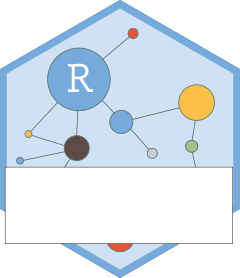

<!-- README.md is generated from README.Rmd. Please edit that file -->

```{r, include = FALSE}
knitr::opts_chunk$set(
  collapse = TRUE,
  comment = "#>",
  fig.path = "man/figures/README-",
  out.width = "100%"
)
```

<!-- badges: start -->
[](https://www.tidyverse.org/lifecycle/#maturing)
[](https://cran.r-project.org/package=connectapi)
[](https://codecov.io/gh/rstudio/connectapi?branch=main)
[](https://github.com/rstudio/connectapi/actions)
<!-- badges: end -->

# connectapi 

This package provides an R client for the [RStudio Connect Server
API](https://docs.rstudio.com/connect/api/) as well as helpful functions that
utilize the client. The package is based on the `rsconnnect`
[package](https://rstudio.github.io/rsconnect/), but is publicly exported to be
easier to use, is extensible via an R6 class, and is separated from the
`rsconnect` package for easier support and maintenance.

## Disclaimer

Because many of these functions are experimental, it is advisable to be cautious
about (1) upgrading the package, (2) upgrading RStudio Connect when you care
about the reproducibility of workflows that use `connectapi`. As a result, we
would advise:

- managing package versions with [`renv`](https://rstudio.github.io/renv/)
- test your dependent content before and after upgrading RStudio Connect

Please pay careful attention to the lifecycle badges of the various functions
and warnings present when you are using experimental features.

**Also, [please share
feedback!!](https://community.rstudio.com/c/r-admin/rstudio-connect/27) We love
hearing how the RStudio Connect Server API is helpful and what additional
endpoints would be useful!!**

## Installation

To install the development version:

```r
remotes::install_github('rstudio/connectapi')
```

## Client

To create a client:

```{r, eval = FALSE}
library(connectapi)
client <- connect(
  server = 'https://connect.example.com',
  api_key = '<SUPER SECRET API KEY>'
)
```

You can also define the following environment variables (in a `.Renviron` file, for instance):

```
CONNECT_SERVER  = https://connect.example.com
CONNECT_API_KEY = my-secret-api-key
```

These environment variable values will be used automatically if defined in your R session.

```{r, eval = FALSE}
library(connectapi)
client <- connect()
```

## Getting Started

Once a client is defined, you can use it to interact with RStudio Connect.

### Exploring Data

You can use the `get_` methods to retrieve data from the RStudio Connect server.

```r
library(connectapi)
client <- connect()

# get data
users <- get_users(client)
groups <- get_groups(client)
usage_shiny <- get_usage_shiny(client)
usage_static <- get_usage_static(client)
some_content <- get_content(client)

# get all content
all_content <- get_content(client, limit = Inf)
```

### Deployment

The `rsconnect` package is usually used for deploying content to Connect.
However, if you want to use programmatic deployment with the RStudio Connect
Server API, then these `connectapi` helpers should be useful!

```{r, eval = FALSE}
library(connectapi)
client <- connect()

# deploying content
# NOTE: a `manifest.json` should already exist from `rsconnect::writeManifest()`

bundle <- bundle_dir("./path/to/directory")
content <- client %>% 
  deploy(bundle, name = "my-app-name") %>% 
  poll_task()

# set an image for content

content %>% 
  set_image_path("./my/local/image.png")

content %>% 
  set_image_url("http://url.example.com/image.png")

# set image and a vanity URL

content %>%
  set_image_path("./my/local/image.png") %>%
  set_vanity_url("/my-awesome-app")
  
# edit another piece of content

client %>%
  content_item("the-content-guid") %>%
  set_vanity_url("/another-awesome-app")
  
# migrate content to another server

client_prod <- connect(
  server = "prod.example.com",
  api_key = "my-secret-key"
)

prod_bnd <- client %>%
  content_item("the-guid-to-promote") %>%
  download_bundle()

client_prod %>%
  deploy(prod_bnd, title = "Now in Production") %>%
  set_vanity_url("/my-app")

# open a browser to the content item
client_prod %>% browse_dashboard()
client_prod %>% browse_solo()
```

## Troubleshooting and FAQ

**Access Denied Errors?**

This is likely due to either (1) `Connect$server` or `Connect$api_key` being
defined improperly or (2) you do not have access to the RStudio Connect cluster
to do the operation in question

**Constant warning about version numbers**

This warning is intentionally chatty. While version number mismatches between
RStudio Connect and `connectapi` can be benign, we want you to be clear that
`connectapi` is tightly coupled to a version of RStudio Connect (because RStudio
Connect's APIs change over time).

We strive to:

- track the latest version of the RStudio Connect API
- add new features as they come available and have demand
- maintain backwards compatibility

These priorities are sometimes at odds, and sometimes they create
inconsistencies between versions as a result. To mitigate this, we recommend:

- Track the version of `connectapi` in use for your applications by using `renv`
- Test high value content that uses `connectapi` before updating `connectapi` or RStudio Connect
- Update RStudio Connect to the latest version _first_ when an update to `connectapi` is needed

**Error - Need to update RStudio Connect**

As a helpful clarification for users, we have added error messages to API
requests when the version implemented in the package specifically introduces a
backwards incompatible dependency on older versions of RStudio Connect.

If you get this error message, our recommendation would be:

- Look at [`NEWS.md`](./NEWS.md) to find the moment the change was introduced
- Downgrade `connectapi` to the previous version of the package
- (Advanced) Use the "blame" feature on GitHub to track commits and find out when the error was introduced

Please feel free to open an Issue if you think there is a bug, or ask a
free-form question on [RStudio
Community](https://community.rstudio.com/c/r-admin/rstudio-connect/27)

**Other ideas for FAQs or Common Issues?**

Please submit a PR! We would love to have your contribution!

## Code of Conduct

Please note that the connectapi project is released with a [Contributor Code of
Conduct](https://pkgs.rstudio.com/connectapi/CODE_OF_CONDUCT.html). By
contributing to this project, you agree to abide by its terms.
